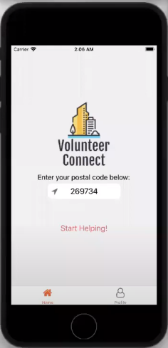
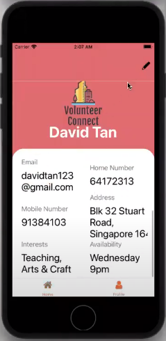
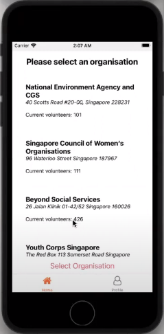
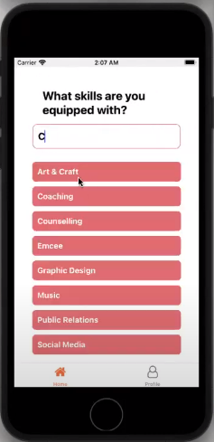
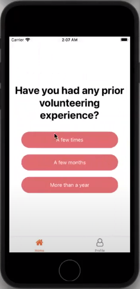
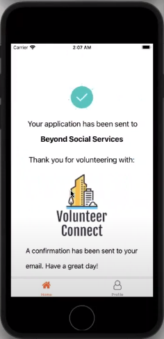

# Volunteer Connect


**Team Members:**

- Chia Tse En
- Leong Jia Hao Daniel
- Khor Jun Wei

## Introduction

Volunteer Connect is a platform where users are able to look for voluntary organisations near their homes, fill in their data through our profile page and be able to get in contact with these organisations easily. 

### Problem statement

Volunteer Connect was created for Lifehack 2022

**The problem statement:** Q1. Volunteering is one of the best ways to give back to our community. What creative ideas do you have to
make volunteering easier, widespread, and more beneficial to those in need?

## Pitch

https://www.youtube.com/watch?v=RwTnpe_jrn8&ab_channel=daniel

### Screenshots













## Running the application

Do ensure that you have NodeJS, NPM and Expo installed on your workstation.

After cloning the repository, run the following line to install the dependencies:

```bash
npm install
```

Open your simulator and start the package by running:

```bash
npm start
```
